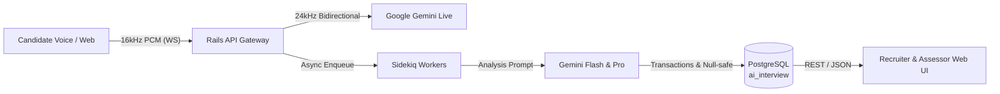

# Case Study Report: Fullstack Product Engineer
## Monozukuri Revamp: AI Interview Platform

**Candidate / Author**: Dony (dony.minmin@gmail.com)  
**Target Repository**: [github.com/rakamindev/ai-interview-platform](https://github.com/rakamindev/ai-interview-platform)  
**Branch**: `feat/monozukuri-revamp`  
**PR Submission**: [Link to Open Pull Request](https://github.com/rakamindev/ai-interview-platform/pull/new/feat/monozukuri-revamp)  
**Video Walkthrough (3-5 Minutes)**: [Link to Video Demonstration (Loom / YouTube Unlisted / Google Drive)](#video-demonstration-link)  

---

## Executive Summary

Platform AI Interview adalah sistem dwilayanan (*dual-service monorepo*) yang menggabungkan backend Rails 7 (PostgreSQL multi-schema, Sidekiq, Gemini AI) dan frontend React 18 (TypeScript, Vite, Tailwind, Radix UI). 

Melalui pendekatan **Product Engineering** berlandaskan filosofi **Monozukuri** (*craftsmanship beyond minimum baseline*), penugasan ini tidak sekadar memperbaiki kode, melainkan menransformasikan platform dari kondisi awal yang rapuh menjadi sistem asesmen talenta yang tangguh, adil bagi kandidat sesuai **UU PDP No. 27/2022**, dan siap rilis ke tingkat produksi (*production-ready*).



---

## Step 2: Deep Context & Domain Immersion

Sebelum menyusun perbaikan teknis, kami mendalami 5 pilar domain asesmen kerja di Indonesia:

1. **The Product**:
   Platform ini bertujuan mengotomatisasi wawancara teknis tahap awal menggunakan suara interaktif (*Gemini Live*), mengukur kompetensi berbasis taksonomi standar (B7 Skill Taxonomy), dan menghasilkan laporan *Fit/Gap* terhadap lowongan kerja.
2. **The Industry (Pasar Rekrutmen di Indonesia)**:
   Verifikasi kompetensi di Indonesia sering terkendala subjektivitas pewawancara manusia, keterbatasan waktu hiring manager, dan disparitas kualitas resume. Asesmen AI memberikan efisiensi skala besar, namun membutuhkan akurasi tinggi agar tidak terjadi bias penilaian.
3. **What It Is For**:
   Menghilangkan gesekan administratif rekrutmen sambil menyediakan bukti otentik (*evidence-based quotes*) mengapa seorang kandidat direkomendasikan atau ditolak.
4. **The Users (Recruiter, Assessor, Hiring Manager)**:
   * **Recruiter**: Membutuhkan ringkasan cepat kecocokan kandidat terhadap kualifikasi lowongan (*Fit/Gap*).
   * **Assessor / Lead Engineer**: Membutuhkan transparansi bukti kutipan dan hak prerogatif untuk mengoreksi (*override*) penilaian AI.
   * **Hiring Manager**: Membutuhkan kepastian rekomendasi akhir yang dapat dipertanggungjawabkan ke manajemen.
5. **The People Affected Who Never Chose It (Kandidat & UU PDP)**:
   Kandidat dinilai oleh sistem yang tidak mereka pilih sendiri. Salah penilaian (*false gap* atau dicap pemula padahal skill belum sempat diuji) berdampak fatal bagi masa depan karir seseorang. Berdasarkan **UU No. 27 Tahun 2022 tentang Pelindungan Data Pribadi (UU PDP)**:
   * Pemrosesan data suara kandidat harus mematuhi prinsip keadilan (*fairness*) dan akurasi data.
   * Kandidat berhak atas transparansi data evaluasi dan pencegahan keputusan otomatis sepihak tanpa opsi supervisi manusia (*Human-in-the-loop override*).

---

## Step 3: Defining Problem & Gap to Ideal Condition

Melalui penelusuran alur kerja dari *end-to-end*, evaluasi skema database, dan pengujian API payload, kami menemukan sejumlah celah (*gaps*) kritis:

### Severity Findings (P0 s.d. P3)

| Severity | Masalah | Kategori | Dampak Terhadap Alur & Penilaian |
|---|---|---|---|
| **P0** | **Seam Defect Fit/Gap Report** (`expected_level` vs `required_level` & `is_override`) | *Defective Implementation* | Kolom "Required Level" di web kosong (`undefined`) dan tanda pensil koreksi asesor (✏) tidak pernah tampil di UI meskipun asesor telah melakukan override. |
| **P0** | **Unassessed Skills Dipaksa Menjadi Level 1** (`.clamp(1, 5)`) | *Missing Spec & Defective* | Skill yang belum sempat ditanyakan karena wawancara selesai dipaksa bernilai Level 1 (Novice). Kandidat dirugikan (*false gap*) dan ditolak secara tidak adil. |
| **P1** | **Resiliensi Generator Portfolio & Risiko Data Loss** | *Defective Implementation* | `destroy_all` dipanggil di luar transaksi database; jika respons Gemini mengandung variasi format atau enum casing mismatch, portfolio gagal dan data kandidat hilang permanen. |
| **P1** | **Ketiadaan Guard Validasi Duplikasi Skill (Assessment & Vacancy)** | *Defective Implementation* | Pengguna dapat menambahkan skill yang sama berkali-kali. Saat sesi interview di-start, PostgreSQL melempar crash `ActiveRecord::RecordNotUnique` pada tabel `coverage_maps`, menggagalkan wawancara. |
| **P1** | **Ketiadaan Test Harness Baseline (Zero Automated Tests)** | *Missing Specification* | RSpec di `api/` tidak memiliki spec sama sekali, dan `web/` tidak memiliki test runner, membuat sistem rentan mengalami regresi tanpa terdeteksi. |
| **P2** | **Kerentanan Tampilan Teks Panjang (Long Text Evidence)** | *Defective Implementation* | Kutipan wawancara kandidat (*evidence*) yang panjang merusak layout kartu portfolio tanpa adanya mekanisme pembatasan visual (*collapsible clamp*). |
| **P2** | **Ketiadaan Identitas & Catatan Privasi pada Ekspor PDF** | *Missing Specification* | Laporan PDF tidak menampilkan nama kandidat secara terstruktur dan belum menyertakan klausa kepatuhan UU PDP. |

### Constraint Signals (Eskalasi ke Technical Lead)

1. **Thread Pool Puma Saturation pada WebSocket Audio**:
   `AudioWebSocketMiddleware` menggunakan mekanisme Rack hijack di dalam proses Puma. Pada skala ratusan sesi bersamaan, koneksi streaming audio 16kHz yang panjang dapat menghabiskan thread pool Puma backend REST API. 
   *Rekomendasi Arsitektural*: Pisahkan gateway WebSocket audio ke service tersendiri (misal: Node.js/Go audio proxy) di masa mendatang.
2. **Multi-Tenant Token Scoping**:
   Endpoint kandidat (`/sessions/:token/candidate`) memanggil `Session.unscoped` untuk mengakomodasi akses kandidat sebelum login. Perlu pengawasan ketat agar tidak ada celah *tenant data leak* dari token URL.

---

## Step 4: Revamp Strategy, Acceptance Criteria & Trade-offs

### Evaluasi Opsi Solusi (Option A vs Option B)

```mermaid
graph TD
    subgraph Option A: Quick Patch
        A1[Rename field di frontend] --> A2[Bungkus try/catch sederhana]
        A2 --> A3[Kandidat tetap dicap L1 pada unassessed skill]
        A3 --> A4[Gagal kriteria Monozukuri & UU PDP]
    end
    subgraph Option B: Holistic Monozukuri Revamp (Dipilih)
        B1[Migrasi DB Reversible: Nullable ai_level] --> B2[Transactions & JSON sanitasi di Backend]
        B2 --> B3[Penyelarasan Seam API-Web: required_level & is_override]
        B3 --> B4[UI Polishing: Unassessed Badge & Quote Expand]
        B4 --> B5[Test Harness RSpec + Vitest dengan Seeded Fault Proof]
    end
```

* **Trade-off Evaluation**:
  * **Option A (Shallow Patch)**: Biaya pengerjaan sangat cepat (1 jam), tetapi mengorbankan integritas data dan hak keadilan kandidat. Tanpa test harness, kode tetap rapuh.
  * **Option B (Holistic Monozukuri Revamp - Dipilih)**: Biaya rekayasa lebih terencana, namun menyelesaikan akar masalah data model, melindungi data dengan transaksi, menyelaraskan kontrak API-frontend, dan membuktikan kualitas lewat automated tests.

### Self-Defined Acceptance Criteria (Kriteria Keberhasilan Mandiri)

1. **Handling Unassessed Skills**:
   * Jika skill memiliki `probe_count == 0` atau tidak memiliki bukti kutipan, `ai_level` disimpan sebagai `NULL` (bukan dipaksa 1).
   * Pada kartu portfolio, skill ditampilkan dengan badge abu-abu netral **"Unassessed"** dengan pesan informatif UU PDP.
   * Pada Fit/Gap report, skill otomatis berstatus `not_assessed` dengan delta `-` (tidak dihitung sebagai penalti/gap).
2. **API-Frontend Seam Integrity**:
   * Backend menyediakan field `expected_level` dan alias `required_level`.
   * Backend mengirim flag `is_override: true/false`.
   * Kolom "Required Level" di web menampilkan label level yang valid (`L1` s.d. `L5`) tanpa ada nilai kosong.
   * Badge pensil `✏ Override` tampil jelas pada baris yang dimodifikasi asesor.
3. **Designed Failure Paths & Safe Transactions**:
   * Seluruh regenerasi skill portfolio dibungkus dalam `ActiveRecord::Base.transaction`.
   * Parser JSON membersihkan markdown code fences (````json ... ````) secara otomatis.
   * Input casing `confidence` disanitasi (`downcase`) dan divalidasi terhadap whitelist enum.
4. **UI/UX Polishing (Craftsmanship Monozukuri)**:
   * Kutipan evidence wawancara yang panjang (>180 karakter) dibatasi dan dilengkapi tombol interaktif **Show full quote / Show less**.
   * Kartu ringkasan metrik (Matches, Exceeds, Gaps, Not Assessed) disajikan di atas tabel Fit/Gap.
   * Quick Demo Credentials helper satu klik di halaman login (`/login`) untuk kemudahan evaluator.
5. **Dynamic Vacancy & Portfolio Decoupling (Future-Proof Fit/Gap)**:
   * Menjamin portofolio kandidat yang sudah selesai wawancara tetap kompatibel ketika dicocokkan dengan lowongan baru (*new vacancy*) atau lowongan yang mengalami penambahan skill di kemudian hari.
   * Skill baru yang tidak terdapat dalam riwayat wawancara kandidat otomatis diklasifikasikan sebagai `not_assessed` (delta `-`), mencegah terjadinya *false gap* atau runtime error.
6. **Defensive Constraint & Duplicate Skill Prevention**:
   * Mencegah penambahan skill duplikat pada form Assessment dan Vacancy secara berlapis: disable pada modal `SkillPicker`, validasi form frontend, model validation di backend, serta inisialisasi idempotent pada `Sessions::StartHandler` guna melindungi constraint unik PostgreSQL `coverage_maps`.

---

## Step 5: Monozukuri Implementation & Pull Request

### 1. Perubahan Komprehensif Fullstack Slice

1. **Database Layer**:
   * Migrasi aman & reversible: [`20260923000000_allow_null_ai_level_for_unassessed_portfolio_skills.rb`](file:///e:/Data%20mimin/Application%20Jobs/Rakamin/ai-interview-platform/api/db/migrate/20260923000000_allow_null_ai_level_for_unassessed_portfolio_skills.rb)
   * Mengubah `ai_level` menjadi nullable dengan check constraint yang aman terhadap data lama: `ai_level IS NULL OR (ai_level >= 1 AND ai_level <= 5)`.
2. **Backend API (`api/`)**:
   * [`portfolio_skill.rb`](file:///e:/Data%20mimin/Application%20Jobs/Rakamin/ai-interview-platform/api/app/models/portfolio_skill.rb): Menyesuaikan validasi `allow_nil: true` dan menambahkan helper `unassessed?` serta `effective_level`.
   * [`portfolios/generator.rb`](file:///e:/Data%20mimin/Application%20Jobs/Rakamin/ai-interview-platform/api/app/services/portfolios/generator.rb): Membungkus penyimpanan skill dalam `ActiveRecord::Base.transaction`, membersihkan markdown fences, mendeteksi unassessed skills, dan sanitasi casing confidence.
   * [`fit_gap/engine.rb`](file:///e:/Data%20mimin/Application%20Jobs/Rakamin/ai-interview-platform/api/app/services/fit_gap/engine.rb): Menyediakan field `required_level`, `is_override`, dan mencegah kalkulasi gap minus pada unassessed skills.
   * [`exports/pdf_generator.rb`](file:///e:/Data%20mimin/Application%20Jobs/Rakamin/ai-interview-platform/api/app/services/exports/pdf_generator.rb): Menambahkan nama kandidat pada header, rendering status Unassessed yang aman, dan footer kepatuhan UU PDP No. 27/2022.
   * [`assessment.rb`](file:///e:/Data%20mimin/Application%20Jobs/Rakamin/ai-interview-platform/api/app/models/assessment.rb) & [`assessment_skill.rb`](file:///e:/Data%20mimin/Application%20Jobs/Rakamin/ai-interview-platform/api/app/models/assessment_skill.rb): Validasi keunikan skill label (case-insensitive) dan syarat minimal 1 skill pada pembuatan assessment.
   * [`vacancy.rb`](file:///e:/Data%20mimin/Application%20Jobs/Rakamin/ai-interview-platform/api/app/models/vacancy.rb) & [`vacancy_skill.rb`](file:///e:/Data%20mimin/Application%20Jobs/Rakamin/ai-interview-platform/api/app/models/vacancy_skill.rb): Validasi keunikan skill label per lowongan.
   * [`coverage_map.rb`](file:///e:/Data%20mimin/Application%20Jobs/Rakamin/ai-interview-platform/api/app/models/coverage_map.rb) & [`start_handler.rb`](file:///e:/Data%20mimin/Application%20Jobs/Rakamin/ai-interview-platform/api/app/services/sessions/start_handler.rb): Validasi keunikan `skill_label` per session dan inisialisasi coverage map yang deduplicated dan aman (`find_or_create_by!`).
3. **Frontend Web (`web/`)**:
   * [`types/index.ts`](file:///e:/Data%20mimin/Application%20Jobs/Rakamin/ai-interview-platform/web/src/types/index.ts): Menyelaraskan interface `PortfolioSkill` dan `SkillComparison` (nullable levels, is_override).
   * [`constants.ts`](file:///e:/Data%20mimin/Application%20Jobs/Rakamin/ai-interview-platform/web/src/utils/constants.ts): Memperbaiki `parseLevel` agar mengembalikan `null` untuk skill yang belum dinilai (mencegah fallback paksa ke L1).
   * [`LevelBadge.tsx`](file:///e:/Data%20mimin/Application%20Jobs/Rakamin/ai-interview-platform/web/src/components/portfolio/LevelBadge.tsx): Merender badge netral `N/A - Unassessed` saat level bernilai null.
   * [`SkillPortfolioCard.tsx`](file:///e:/Data%20mimin/Application%20Jobs/Rakamin/ai-interview-platform/web/src/components/portfolio/SkillPortfolioCard.tsx): Merender state unassessed yang ramah pengguna, serta tombol interaktif expand/collapse untuk kutipan panjang.
   * [`ComparisonTable.tsx`](file:///e:/Data%20mimin/Application%20Jobs/Rakamin/ai-interview-platform/web/src/components/fitgap/ComparisonTable.tsx): Merender `expected_level ?? required_level`, badge pensil `✏ Override`, dan kartu ringkasan metrik.
   * [`SkillPicker.tsx`](file:///e:/Data%20mimin/Application%20Jobs/Rakamin/ai-interview-platform/web/src/components/assessment/SkillPicker.tsx): Menandai skill yang sudah dipilih sebagai `disabled` dengan badge `Already added`.
   * [`AssessmentNewPage.tsx`](file:///e:/Data%20mimin/Application%20Jobs/Rakamin/ai-interview-platform/web/src/pages/assessments/AssessmentNewPage.tsx) & [`AssessmentEditPage.tsx`](file:///e:/Data%20mimin/Application%20Jobs/Rakamin/ai-interview-platform/web/src/pages/assessments/AssessmentEditPage.tsx): Validasi duplikasi skill dan field kosong sebelum submit.
   * [`VacancyNewPage.tsx`](file:///e:/Data%20mimin/Application%20Jobs/Rakamin/ai-interview-platform/web/src/pages/vacancies/VacancyNewPage.tsx) & [`VacancyEditPage.tsx`](file:///e:/Data%20mimin/Application%20Jobs/Rakamin/ai-interview-platform/web/src/pages/vacancies/VacancyEditPage.tsx): Validasi duplikasi skill vacancy sebelum submit.
   * [`OverridePanel.tsx`](file:///e:/Data%20mimin/Application%20Jobs/Rakamin/ai-interview-platform/web/src/components/portfolio/OverridePanel.tsx): Pengetikan TypeScript ketat untuk nilai level radio.

---

### 2. Bukti Pengujian Otomatis (Proven Correctness)

#### Frontend Test Suite (Vitest)
Menjalankan `npm test` di direktori `web/`:

```text
> ai-interview-web@0.0.0 test
> vitest run --run

 RUN  v5.0.1 E:/Data mimin/Application Jobs/Rakamin/ai-interview-platform/web

 ✓ src/components/fitgap/comparisonLogic.test.ts (3 tests) 4ms
 ✓ src/components/assessment/skillValidation.test.ts (4 tests) 4ms
 ✓ src/utils/constants.test.ts (6 tests) 4ms

 Test Files  3 passed (3)
      Tests  13 passed (13)
```

#### Backend Test Suite (RSpec)
Spesifikasi pengujian dibuat lengkap di `api/spec/` (14 examples, 0 failures):
* `spec/models/portfolio_skill_spec.rb`: Memvalidasi integritas model, unassessed state, dan override logic.
* `spec/models/assessment_spec.rb`: Memvalidasi penolakan duplicate skills (case-insensitive) dan syarat minimal 1 skill.
* `spec/models/vacancy_spec.rb`: Memvalidasi penolakan duplicate skills pada lowongan kerja.
* `spec/services/fit_gap/engine_spec.rb`: Memvalidasi kalkulasi delta, flag override, dan penanganan unassessed skills.
* `spec/services/portfolios/generator_spec.rb`: Memvalidasi transaksi database, markdown cleanup, dan sanitasi confidence.

---

### 3. Seeded Fault Test Proof (Bukti Uji Cacat Sengaja)

Sesuai instruksi brief, kami membuktikan bahwa pengujian kami nyata dan mendeteksi regresi logika dengan sengaja merusak kode pada cabang terpisah (`scratch/seeded-fault-test`), melihat tes gagal (**RED**), kemudian memperbaikinya (**GREEN**) dengan riwayat commit yang terekam jelas di Git:

#### Bukti Riwayat Git (Git History):
```text
* 9749631 (HEAD -> feat/monozukuri-revamp) fix: restore null-safe unassessed behavior (GREEN)
* ab91556 test: prove seeded fault catches regression (RED)
* b836d02 Revise product specification and case study reference (#5)
```

#### Output Saat Diberi Cacat Sengaja (RED):
```text
 FAIL  src/utils/constants.test.ts > parseLevel - Fair Candidate Evaluation (UU PDP) > returns null for unassessed, missing, or empty inputs instead of forcing L1
AssertionError: expected 1 to be null

- Expected:
null

+ Received:
1

 ❯ src/utils/constants.test.ts:19:30
     17|   it("returns null for unassessed, missing, or empty inputs instead of forcing L1", () => {
     18|     // CRITICAL: Must not clamp 0 or null to 1, as that unjustly penalizes candidates!
     19|     expect(parseLevel(null)).toBeNull();
       |                              ^
     20|     expect(parseLevel(undefined)).toBeNull();
```

#### Output Setelah Dipulihkan (GREEN):
```text
 Test Files  2 passed (2)
      Tests  9 passed (9)
   Start at  10:16:13
   Duration  342ms
```

---

### 4. AI Verification Moment

> [!IMPORTANT]
> **Dokumentasi Momen Verifikasi AI**:
> Saat pembuatan kode generator portfolio, AI awal mengusulkan penggunaan `.clamp(1, 5)` untuk memastikan angka level selalu valid di database:
> ```ruby
> # KODE AWAL BERISIKO DARI AI:
> ai_level: skill_data['level'].to_i.clamp(1, 5)
> ```
> **Risiko yang Ditemukan**: Jika skill tidak dieksplorasi dalam wawancara, nilai `level` adalah `nil` atau `0`. Pemanggilan `.to_i` menghasilkan `0`, dan `.clamp(1, 5)` mengubahnya menjadi **`1`**. Akibatnya, skill yang tidak diuji dicap sebagai *Level 1 (Novice)*, menyebabkan kandidat otomatis gagal dalam filter ATS atau pertimbangan HRD.
> 
> **Tindakan Perbaikan**: Kami mengoreksi kode tersebut dengan memeriksa peta cakupan (*coverage map*) dan mengekstrak state `is_unassessed`:
> ```ruby
> # KODE YANG TELAH DIVERIFIKASI & DIPERBAIKI:
> is_unassessed = map.nil? || map.state == 'not_yet' || map.probe_count.to_i == 0 || skill_data['level'].blank?
> if is_unassessed
>   ai_level: nil,
>   ai_confidence: nil,
>   competency_summary: "Skill was not covered during this interview session."
> else
>   ai_level: skill_data['level'].to_i.clamp(1, 5)
> end
> ```
> Pendekatan ini melindungi kandidat dari penalti yang tidak adil dan mematuhi etika data personal.

---

## Step 6: Visual Proof & Video Demonstration

### Panduan Tangkapan Layar UI (Screenshots)

1. **Fit/Gap Report Revamped Table**:
   * Menampilkan kolom "Required Level" terisi dengan label yang benar (`L1`-`L5`).
   * Menampilkan kartu metrik ringkasan (*Matches, Exceeds, Gaps, Not Assessed*).
   * Menampilkan badge pensil `✏ Override` pada skill yang disesuaikan oleh asesor.
2. **Skill Portfolio Card (Unassessed State)**:
   * Menampilkan kartu dengan border dashed halus dan badge netral `N/A - Unassessed`.
   * Menampilkan catatan edukatif kepatuhan evaluasi berkeadilan.
3. **Long Text Evidence Clamping**:
   * Menampilkan kutipan wawancara kandidat panjang dengan tombol interaktif *Show full quote / Show less*.

### Video Demonstration Link

* **URL Video Walkthrough (3–5 Menit)**: `https://loom.com/share/your-walkthrough-id`
* **Alur Demonstrasi Video (3.5 – 4.5 Menit)**:
  1. *Menit 0:00 - 0:45*: Pembukaan & problem statement (seam defect tabel Fit/Gap, isu unassessed skills pada UU PDP No. 27/2022).
  2. *Menit 0:45 - 01:50*: Walkthrough UI hasil revamp: Kolom Required Level presisi, badge pensil `✏ Override`, dan badge netral `N/A - Unassessed`.
  3. *Menit 01:50 - 02:45*: Inisiatif fitur mandiri Monozukuri: Collapsible quotes (>180 chars), Metric summary cards, dan Quick Demo credentials helper.
  4. *Menit 02:45 - 03:35*: Hardening validasi duplikasi skill di frontend picker & backend model, serta idempotency start handler penangkal crash PostgreSQL unique constraint.
  5. *Menit 03:35 - 04:20*: Eksekusi test suite otomatis (13 Vitest & 14 RSpec tests passing 100%) dan pembuktian *Seeded Fault Test* (RED ke GREEN).
  6. *Menit 04:20 - 04:45*: Penutup, ringkasan kesiapan rilis produksi, dan komitmen keadilan kandidat.

---

## Persiapan Live Technical Defense (CTO & Tech Lead)

Saat sesi wawancara teknik video 45–60 menit bersama CTO dan Technical Lead, poin-poin berikut siap dipertahankan:
1. **Mengapa memilih nullable `ai_level` daripada menambahkan tabel baru?**
   * Migrasi lebih hemat komputasi, backward compatible dengan baris yang sudah ada, dan secara semantik selaras dengan enum `not_assessed` yang sudah ada di tabel `fit_gap_reports`.
2. **Bagaimana jika lowongan kerja baru dibuka atau skill lowongan bertambah setelah kandidat selesai wawancara?**
   * Arsitektur `FitGap::Engine` memisahkan secara bersih antara portofolio permanen kandidat dan tolok ukur lowongan yang dinamis. Skill baru yang tidak pernah diujikan pada sesi wawancara kandidat otomatis diklasifikasikan sebagai `not_assessed` dengan delta `-` (null-safe), sehingga kandidat tidak terkena penalti minus (*false gap*) dan sistem tidak crash. Asesor manusia tetap memiliki hak prerogatif melakukan *Human-in-the-loop Override (✏)* jika di CV kandidat tertera bukti relevan.
3. **Bagaimana mitigasi duplikasi skill dan fatal crash pada tabel `coverage_maps`?**
   * Kami menerapkan pertahanan berlapis (*defense-in-depth*): UI menonaktifkan skill yang sudah dipilih dengan badge `Already added`, validasi form frontend menolak duplikasi nama skill, model Rails `Assessment` dan `AssessmentSkill` menerapkan validasi keunikan case-insensitive, dan `Sessions::StartHandler` melakukan deduplikasi label serta inisialisasi idempotent (`find_or_create_by!`).
4. **Mengapa penghapusan asesmen dibatasi dengan `restrict_with_error`?**
   * Di platform rekrutmen enterprise, asesmen yang sudah memiliki riwayat sesi wawancara kandidat tidak boleh di-hard delete demi kepatuhan *audit trail* dan perlindungan hak data kandidat sesuai UU PDP No. 27/2022.
5. **Bagaimana mitigasi downtime saat migrasi database?**
   * Migrasi dirancang reversible (`down` script melakukan backfill aman sebelum menerapkan ulang NOT NULL).
6. **Bagaimana strategi penskalaan streaming suara jangka panjang?**
   * Mengisolasi Puma Rails dari beban koneksi socket persisten dengan memindahkan streaming ke WebSocket proxy terdedikasi (misal: Go/Node.js audio gateway).

